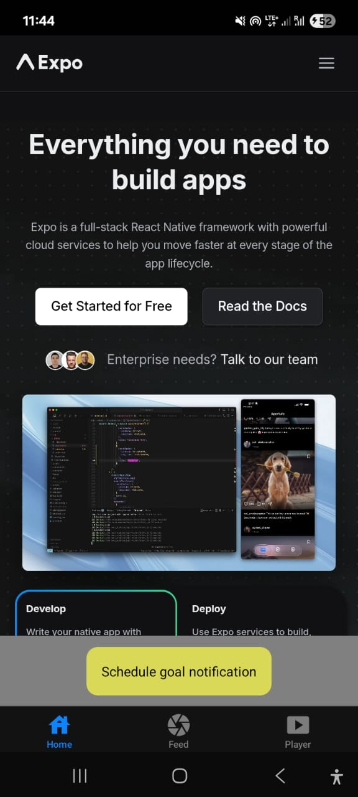
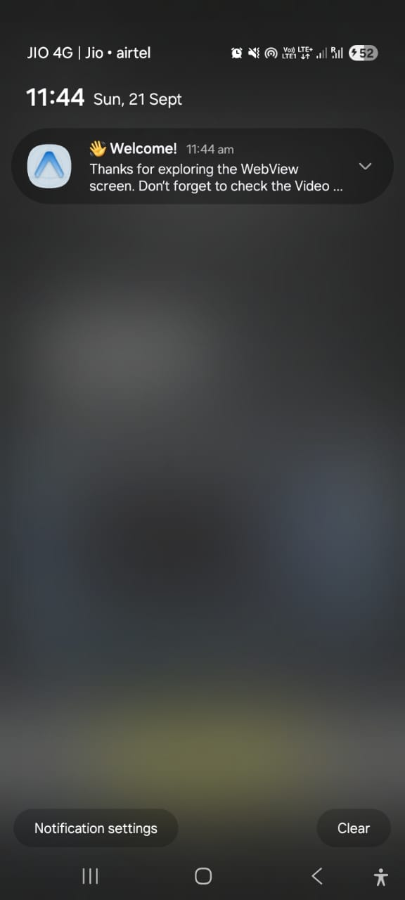
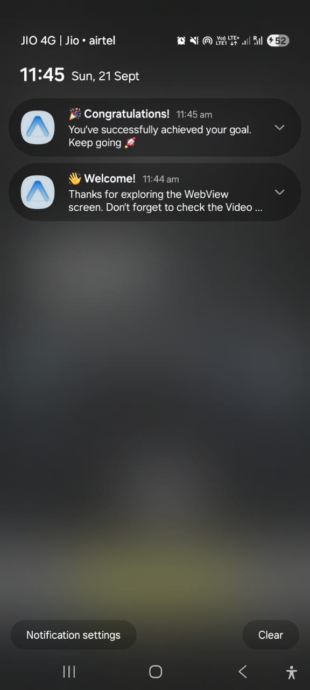
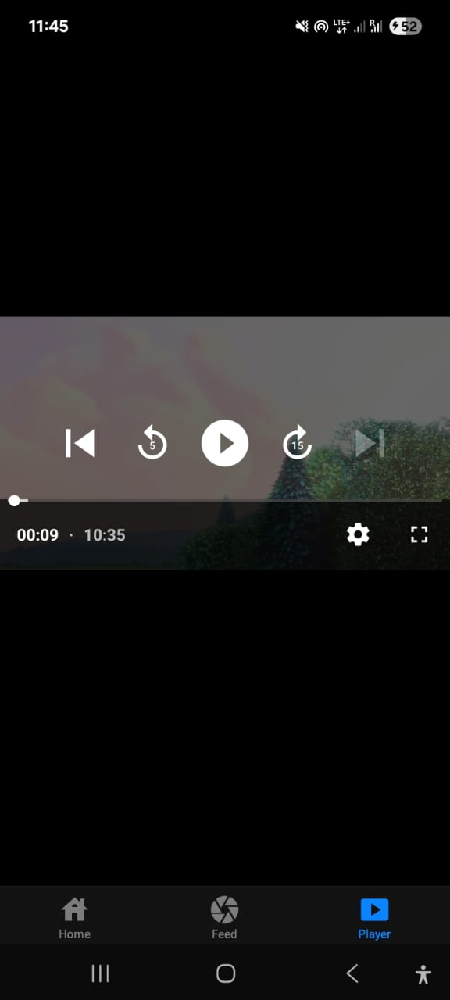
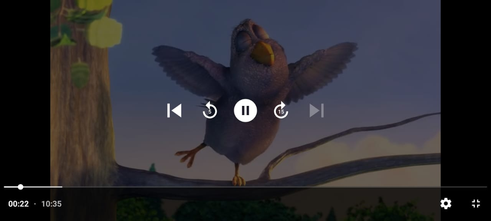
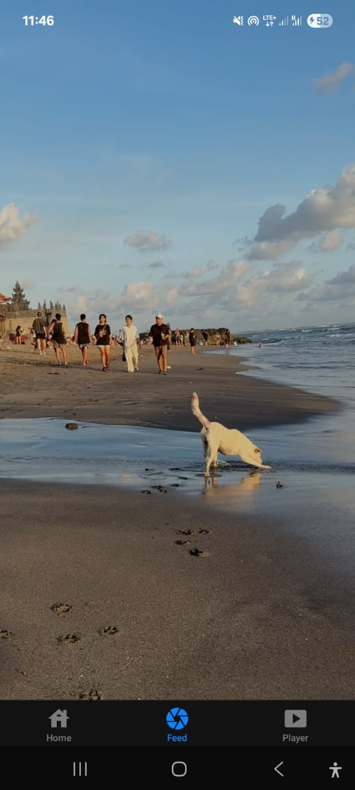
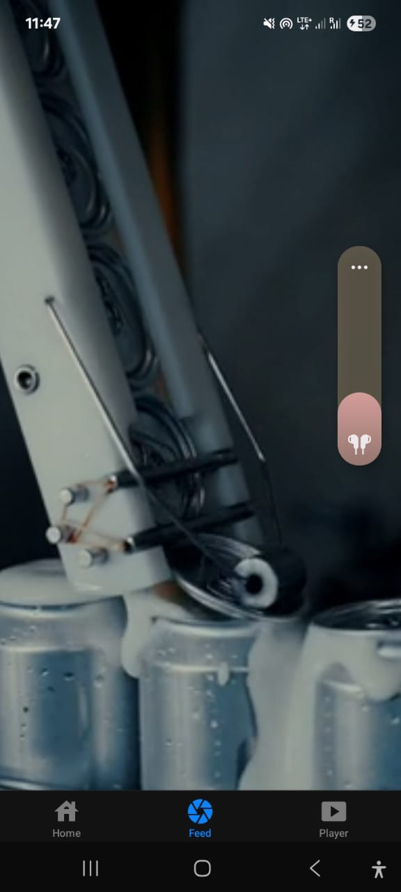

# React Native (Expo) Assignment: WebView + Notifications + Video Player 

## [DEMO](https://drive.google.com/file/d/15Ehek2xPdnFSlBoZnt76NVPVp1-o71Jc/view?usp=drive_link)

## Project Setup Guide

1. clone the `https://github.com/thesopan21/webview-notify-video.git`
2. navigate to `cd webview-notify-video` directory
3. make sure `node_module` must be present in you project dir if not `npm i`
4. run the dev server by executing `npx expo start`

## Implementation Choices

### 1. WebView

- Used react-native-webview to embed a website inside the app.
- Chosen for its simplicity and support for both iOS and Android.
- Added two buttons below the WebView to trigger notifications, keeping UI consistent and user-friendly.

### 2. Notifications

- Used Expo Notifications API for scheduling local notifications.
- Chose delayed notifications (2–5 seconds) to demonstrate async scheduling.
- Implemented two distinct messages to showcase flexibility.

### 3. Video Player

- Used expo-av's Video component to play the HLS stream.
- Chosen because Expo supports HLS out-of-the-box, with controls like play, pause, and fullscreen.
- Tested with the sample stream:
<https://test-streams.mux.dev/x36xhzz/x36xhzz.m3u8>

### 4. Navigation

- This allows smooth switching between WebView + Notifications and Video Player screens.

### 5. Project Structure

- app/ → contains screens and navigation setup.
- components/ → reusable UI components.
- assets/ → images, icons, and screenshots.
